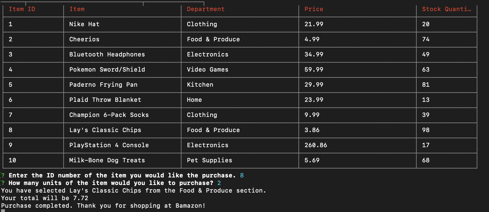
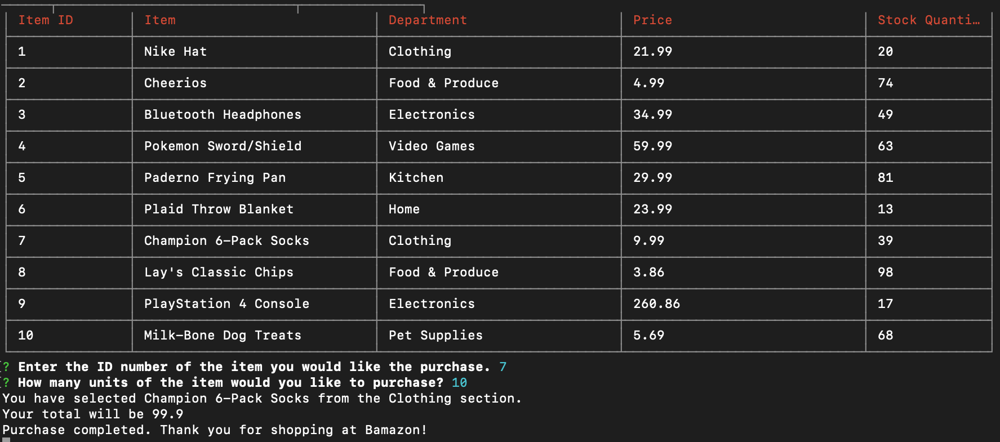

# Bamazon
# Introduction
Bamazon is a CLI application that will display 10 products available for purchase. The user can select which item ID they would like to buy and the quantity. Afterwards, the app will display the total for the user.

# Commands
After typing in ```<node bamazonCustomer.js>```, the user will be asked: ```Enter the ID number of the item you would like the purchase.```. When the user enters a number between 1-10, the next prompt will ask: ```How many units of the item would you like to purchase?```. Once confirmed, the app will display which item and which department it is from, with the total printed right after.

# Examples




# Sources/Technologies Used
* Javascript, Node.js, Node packages (inquirer, cli-table), MySQL
